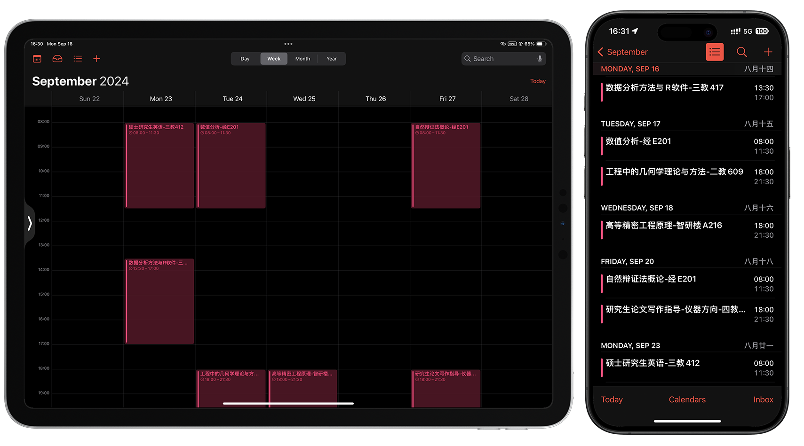
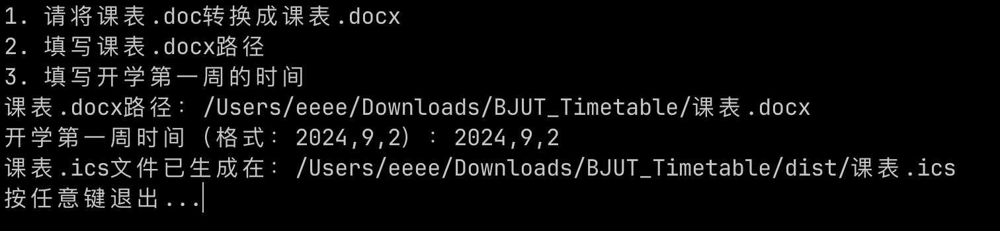

## 北京工业大学课表生成工具
> 仅可导出为ics文件，导入IOS内置日历
> 目前仅通过研究生课表测试

## 使用方法
1. (下载Release中的exe文件)[https://github.com/eeee0717/BJUT_Timetable/releases/download/Release/release.zip]
2. 运行exe文件
3. 将课表.doc文件转换为课表.docx文件(从研究生管理系统 课表查询中打印导出)
4. 复制课表路径到输入框中
5. 输入学期开始日期（第一周的周一日期）
6. 在IOS日历中新建日历，再导入ics文件

